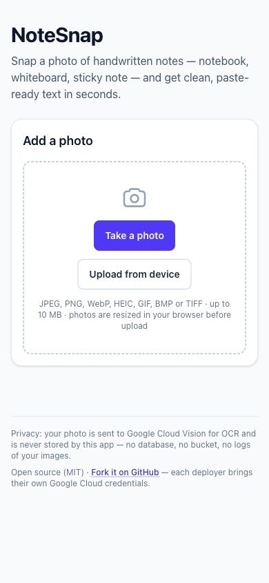
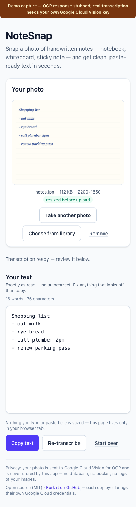

# 📸 NoteSnap

**Snap a photo of handwritten notes — notebook, whiteboard, sticky note — and get clean, editable, paste-ready text in seconds.**

[](./LICENSE)
[](https://nextjs.org)
[](https://vercel.com/new/clone?repository-url=https%3A%2F%2Fgithub.com%2FMHK-ctrl%2Fnotesnap&env=GOOGLE_VISION_API_KEY&envDescription=Your%20own%20Google%20Cloud%20Vision%20API%20key%20%28server-side%20only%2C%20never%20exposed%20to%20the%20browser%29&envLink=https%3A%2F%2Fconsole.cloud.google.com%2Fapis%2Fcredentials&project-name=notesnap&repository-name=notesnap)





<sub>Both images are real captures of this app at a 390px mobile viewport. The first is
the upload screen. The second shows the result screen with a **stubbed transcription** —
the OCR response was mocked so the capture could be taken without a Google Cloud key — and
it carries a visible label saying so. Read it as a UI sample, not as an OCR result; a GIF
of a real snap → text run is the next upgrade here.</sub>

> ### 🔑 Each deployer brings their own Google Cloud credentials
>
> This repository ships **no API key** and never will. OCR requests are billed to
> whoever owns the key, so **you run NoteSnap against your own Google Cloud
> project**. Setup takes about five minutes — see
> [Get a Vision API key](#get-a-google-cloud-vision-api-key-step-by-step).

> ### 🔍 Live demo
>
> **<https://notesnap-theta.vercel.app>** — the UI, the camera input, the
> browser-side resizing and every validation check run for real there.
>
> <sub>The hosted demo is provisioned **without** a Google Cloud key, so a real
> upload answers with the "missing credentials" message instead of text — that is
> the app refusing to fake a result rather than a broken button. Add your own key
> to your own deployment (below) and transcription works end to end. OCR is billed
> per image, which is why the shared demo doesn't carry the maintainer's key.</sub>

---

## Features

- 📷 **Camera or gallery** — the primary input opens the rear camera directly on phones, with a second input for existing photos.
- 🖼️ **Preview before you send** — you see the exact photo that will be uploaded, plus its size and dimensions.
- 🗜️ **Compressed in the browser** — images are capped at 2200px on the longest edge and re-encoded at high JPEG quality before upload, which cuts upload time and Vision payload size.
- ✍️ **Handwriting-trained OCR** — Google Cloud Vision `DOCUMENT_TEXT_DETECTION` over a server-side API route.
- ✏️ **Editable result** — fix OCR mistakes in a plain textarea before you use the text.
- 📋 **Copy in one tap** — with a "Copied!" confirmation.
- 🔁 **Re-transcribe** — run the same photo through OCR again without re-taking it.
- 🔄 **Start over** — clears the photo, the text and any errors.
- 🚦 **Clear states** — loading, and human-readable errors for wrong type, oversized file, blank page, OCR failure and missing credentials.
- 🔒 **No auto-correct** — NoteSnap shows literally what OCR read. It never silently "fixes" your words.
- 📱 **Mobile-first and accessible** — labelled controls, keyboard-friendly, live regions for status updates, visible focus rings.

## How it works

```text
 ┌─────────────────────────── browser ───────────────────────────┐
 │ 1. <input type="file" accept="image/*" capture="environment"> │
 │ 2. preview the photo  (object URL, stays on your device)      │
 │ 3. resize to max 2200px + re-encode as JPEG (canvas)          │
 │ 4. POST multipart/form-data ──────────────────────────────────┼──┐
 └───────────────────────────────────────────────────────────────┘  │
                                                                    ▼
 ┌─────────────────────────── server (Vercel) ─────────────────────────┐
 │ 5. /api/transcribe  → rate limit → re-validate type & size (≤10MB)  │
 │ 6. Google Cloud Vision: images:annotate + DOCUMENT_TEXT_DETECTION   │
 │    (key read from process.env, server-side only)                    │
 │ 7. return the literal text                                          │
 └─────────────────────────────────────────────────────────────────────┘
                                                                    │
 ┌─────────────────────────── browser ────────────────────────────────┐
 │ 8. editable textarea → copy / re-transcribe / start over           │
 └────────────────────────────────────────────────────────────────────┘
```

- The OCR call lives in exactly one place: `app/api/transcribe/route.ts` → `lib/vision.ts`.
- `lib/vision.ts` is marked `server-only`, so a client component importing it fails the **build** instead of leaking a key.
- Want a different OCR engine? Reimplement `transcribeImage()` in `lib/vision.ts` and nothing else has to change.

## Privacy

- Your image is sent to Google Cloud Vision for processing, then discarded. **NoteSnap does not store your photos or your text** — no database, no blob storage, no upload log.
- The preview and the OCR result live only in your browser tab's memory. Closing the tab loses both.
- Nothing is written to disk on the server; the image is held in memory for the duration of one request.
- The only third party involved is Google Cloud Vision, under [Google Cloud's terms](https://cloud.google.com/terms). If that matters to you, self-host and swap the OCR engine in `lib/vision.ts`.

## Quick start (local)

```bash
git clone https://github.com/MHK-ctrl/notesnap.git
cd notesnap
npm install

cp .env.example .env.local      # then paste your key into GOOGLE_VISION_API_KEY

npm run dev                     # http://localhost:3000
```

Requirements: **Node.js 20 or newer** and npm.

> `navigator.clipboard` needs a secure context. `http://localhost` counts as secure,
> so copy works in local development.

## Get a Google Cloud Vision API key (step by step)

Vision's REST API accepts an API key, so there is no SDK and no service-account
JSON to manage. About five minutes:

1. **Create a project** — <https://console.cloud.google.com/projectcreate>. Name it anything (e.g. `notesnap-dev`).
2. **Enable the Cloud Vision API** — <https://console.cloud.google.com/apis/library/vision.googleapis.com>, select your project, click **Enable**. (OCR requests fail with `403` until this is done.)
3. **Make sure billing is on** — <https://console.cloud.google.com/billing>. Vision has a free monthly tier, but Google requires a billing account on the project. See [Cost & limits](#cost--limits).
4. **Create the key** — <https://console.cloud.google.com/apis/credentials> → **Create credentials** → **API key**.
5. **Restrict the key (recommended)** — in the key's settings, under *API restrictions*, choose **Restrict key** → **Cloud Vision API**. It's a server-side key; there is no need to add HTTP referrer restrictions.
6. **Copy the key** into `.env.local`:

   ```bash
   GOOGLE_VISION_API_KEY=AIza...your-key...
   ```

7. **Restart the dev server.** The key is read per request, but Next.js only loads `.env.local` at startup.

If you'd rather use a service account (`GOOGLE_APPLICATION_CREDENTIALS`) with a
scoped IAM role, that's a better fit for production workloads — you'd exchange the
JSON for an OAuth access token inside `lib/vision.ts`. The API-key path is the
default here because it's the shortest path from clone to working OCR.

## Deploy to Vercel

### One click

[](https://vercel.com/new/clone?repository-url=https%3A%2F%2Fgithub.com%2FMHK-ctrl%2Fnotesnap&env=GOOGLE_VISION_API_KEY&envDescription=Your%20own%20Google%20Cloud%20Vision%20API%20key%20%28server-side%20only%2C%20never%20exposed%20to%20the%20browser%29&envLink=https%3A%2F%2Fconsole.cloud.google.com%2Fapis%2Fcredentials&project-name=notesnap&repository-name=notesnap)

Vercel asks for `GOOGLE_VISION_API_KEY` during setup and keeps it server-side.

### From the CLI

```bash
npm i -g vercel
vercel login
vercel link            # create/link the project
vercel env add GOOGLE_VISION_API_KEY production   # paste your key when prompted
vercel env add GOOGLE_VISION_API_KEY preview      # optional, for preview builds
vercel --prod
```

### Manual steps in the dashboard

1. **Add the project** — *Add New… → Project*, import your fork of `notesnap`.
2. **Add the environment variable** — *Settings → Environment Variables*: name `GOOGLE_VISION_API_KEY`, value = your key, environments = Production (and Preview if you want preview deploys to work).
3. **Redeploy** — env changes only apply to new deployments.
4. **Verify** — open the deployment URL on your phone, take a photo, and watch for text.

### Environment variables (all of them)

| Variable | Required | What it does |
| --- | --- | --- |
| `GOOGLE_VISION_API_KEY` | **Yes** | Authenticates OCR calls. Server-side only — never prefix it with `NEXT_PUBLIC_`. |
| `UPSTASH_REDIS_REST_URL` | Recommended | Shared rate-limit store. Without it, limiting is per-instance only. |
| `UPSTASH_REDIS_REST_TOKEN` | Recommended | REST token paired with that URL. |
| `RATE_LIMIT_MAX` | No | Requests allowed per client per window (default `10`). |
| `RATE_LIMIT_WINDOW_MS` | No | Window length in milliseconds (default `60000`). |

```bash
# add the shared limiter to an existing deployment
vercel env add UPSTASH_REDIS_REST_URL production     # https://your-db.upstash.io
vercel env add UPSTASH_REDIS_REST_TOKEN production   # paste the REST token when prompted
vercel --prod                                        # env changes need a new deployment
```

## Shared rate limiting (Upstash Redis)

A rate limiter that lives in one process's memory can't protect a serverless app:
Vercel runs several instances, each with its own counter. `lib/rate-limit.ts`
therefore uses [@upstash/ratelimit](https://github.com/upstash/ratelimit) with a
sliding window over Upstash Redis, so all instances share one counter.

**Setup (no code changes needed):**

1. Create a database at <https://console.upstash.com> — **Create Database**, pick a
   region close to your users, Redis type is fine.
2. On the database page, copy the **REST URL** and the **REST TOKEN**.
3. Add both to your environment (locally in `.env.local`; on Vercel via the
   commands above or *Settings → Environment Variables*).
4. Redeploy and check which limiter answered:

   ```bash
   curl -s -D - -o /dev/null -F "image=@note.jpg" https://your-app.vercel.app/api/transcribe \
     | grep -i x-ratelimit-mode
   # X-RateLimit-Mode: shared
   ```

**Free tier:** Upstash's free plan is 500,000 commands/month, 256 MB storage and
10 GB bandwidth (as published in 2026 — see
<https://upstash.com/pricing/redis> for the current numbers). One rate-limit check
is a couple of commands, so the free tier covers far more traffic than a demo
gets; the limit that will bite first is Google's ~1,000 free Vision images.

**Behaviour when Redis fails:** the route logs
`shared rate limiter unavailable`, serves the request anyway, and reports
`X-RateLimit-Mode: instance` — a public demo stays usable during an Upstash
outage, at the cost of degraded limiting until it recovers. If you'd rather fail
closed, throw from `checkRateLimit` instead of falling through in
`lib/rate-limit.ts`.

## Cost & limits

The first **~1,000 Vision feature-units per month are free** (the free tier is
monthly, not per-request), after which **DOCUMENT_TEXT_DETECTION is roughly
$1.50 per 1,000 images** — 1,000 or fewer units are free, then pricing is per
1,000 units. See <https://cloud.google.com/vision/pricing> for the current
numbers.

> **Prices and free tiers change.** The link above is the source of truth —
> always check it before sizing a deployment.

Built-in limits to protect a public demo:

| Guard | Default | Where |
| --- | --- | --- |
| Max upload size | 10 MB | `lib/validation.ts` (client *and* server) |
| Photos resized before upload | longest edge 2200px | `lib/image.ts` (browser) |
| Requests per client IP | 10 / 60s | `lib/rate-limit.ts` — Upstash sliding window, per-instance fallback |

**About the rate limiter:** with `UPSTASH_REDIS_REST_URL` and `_TOKEN` set, counters
live in Redis and every serverless instance shares them, so the limit is real
protection rather than a speed bump (see
[Shared rate limiting](#shared-rate-limiting-upstash-redis)). Without those vars the
route falls back to a per-instance counter and logs a warning in production — the
`X-RateLimit-Mode` response header always tells you which mode answered.

Either way, add a **budget alert** in Google Cloud billing so you hear about traffic
spikes before your card does.

## Troubleshooting

| Symptom | Cause | Fix |
| --- | --- | --- |
| `missing_credentials` on every request | `GOOGLE_VISION_API_KEY` isn't set where the app runs | Local: put it in `.env.local` and restart `npm run dev`. Vercel: add it under *Settings → Environment Variables* and **redeploy**. |
| `invalid_credentials` | Key is wrong, deleted, or the Vision API isn't enabled on its project | Re-check the key, then confirm Cloud Vision shows **Enabled** for that project. |
| `403 PERMISSION_DENIED` in logs | Billing isn't enabled, or the key is restricted to a different API | Enable billing on the project; in the key's *API restrictions*, allow **Cloud Vision API**. |
| `no_text` (422) | Vision found no handwriting | Fill the frame with the page, avoid glare and shadows, keep the phone parallel to the paper, use black ink on light paper. |
| Photo looks squashed or unreadable after resizing | Very wide/tall source image | Retake it square-on; the app caps the longest edge at 2200px but never crops. |
| HEIC photos from an iPhone fail | Your browser can't decode HEIC for compression, so the original is sent | Safari handles HEIC; if it still fails, set *Settings → Camera → Formats → Most Compatible*, or export as JPEG. |
| Copy button says "Press Ctrl/Cmd + C" | Non-secure origin — the clipboard API is blocked | Serve over HTTPS (Vercel does this) or use `localhost`. |
| `rate_limited` (429) | More than 10 transcriptions in a minute from one IP | Wait a minute, or raise `RATE_LIMIT_MAX`. |
| `X-RateLimit-Mode: instance` in production | Upstash env vars are missing, so the limiter is per-instance only | Add `UPSTASH_REDIS_REST_URL` + `UPSTASH_REDIS_REST_TOKEN` (see [Shared rate limiting](#shared-rate-limiting-upstash-redis)) and redeploy. |
| Logs say "shared rate limiter unavailable" | Redis was unreachable; the route kept serving on the per-instance fallback | Check the Upstash database is active and the REST token is correct for **both** Production and Preview environments. |
| `413 too_large` | Photo is over 10 MB | Lower the camera resolution, or raise `MAX_FILE_BYTES` in `lib/validation.ts`. |
| Everything works locally, fails on Vercel | Env var added after the last deploy | Redeploy — environment variables are read at runtime, but only new deployments pick them up. |

## Development

```bash
npm run dev        # dev server
npm run build      # production build
npm run lint       # ESLint (including Next.js rules)
npm run typecheck  # tsc --noEmit
npm test           # Vitest unit tests
```

The suite covers the shared validation rules, the image-resize math, both rate
limiter modes (the Upstash wiring is mocked, so no account is needed), the Vision
wrapper (with an injected `fetch`) and the API route's happy and failure paths —
**no Google, Vercel or Upstash credentials required**.

## Project structure

```text
app/page.tsx                    main UI and state machine
app/layout.tsx                  metadata + root layout
app/globals.css                 Tailwind entry and base styles
app/api/transcribe/route.ts     server-only OCR endpoint (validation, rate limit, error mapping)
components/PhotoUpload.tsx      camera/file input, drag & drop, preview
components/TranscriptEditor.tsx editable result + copy / re-transcribe / start over
lib/image.ts                    browser-side resize + re-encode
lib/vision.ts                   Google Cloud Vision wrapper (server-only)
lib/validation.ts               file type + size checks (shared client/server)
lib/rate-limit.ts               rate limiter: Upstash sliding window + per-instance fallback
tests/                          Vitest unit tests
```

## Security notes

- The API key is read from `process.env` on the server and is never sent to the browser. Nothing is prefixed with `NEXT_PUBLIC_`.
- `lib/vision.ts` imports `server-only`, turning any accidental client import into a build error.
- Uploads are validated on the server as well as the client: image MIME types only, 10 MB max, empty-file rejection.
- `.env.local` and `.env*.local` are gitignored; `.env.example` contains placeholders only.
- Rate limiting exists so a public demo can't burn through a deployer's quota (see the caveat above).
- Found a security issue? Please open a private security advisory rather than a public issue.

## Contributing

Contributions are welcome — especially handwriting cases that come out wrong.

1. Fork the repo and branch off `main`.
2. `npm install && npm test && npm run lint && npm run build` should all pass.
3. Keep the OCR call inside `lib/vision.ts`, keep TypeScript strict, and add a test for behaviour you change.
4. Open a PR describing the before/after. Screenshots of a bad transcription help a lot.

Good first issues: a "Download as .txt" button, per-line confidence highlighting,
an Upstash-backed rate limiter, and language hints for non-English handwriting.

## License

[MIT](./LICENSE) — use it, fork it, ship it. Attribution is welcome but not required.
